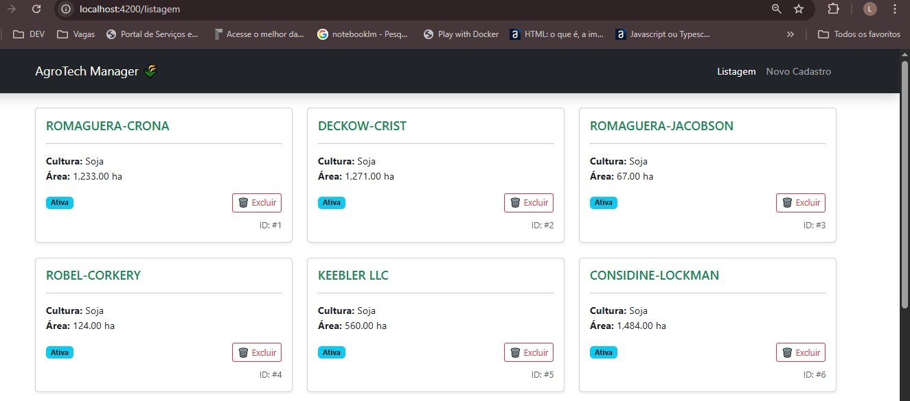
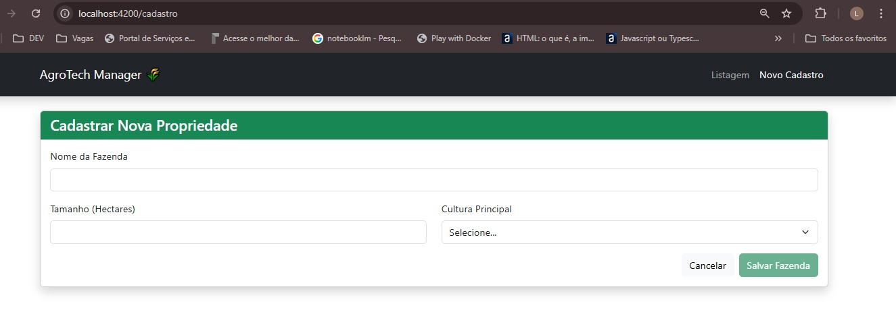

# 🌾 AgroTech Manager - Sistema de Gestão de Fazendas


O **AgroTech Manager** é uma aplicação Single Page Application (SPA) desenvolvida para otimizar o gerenciamento de propriedades rurais. O projeto permite o controle completo (CRUD) de fazendas, integrando validações de negócios e consumo de APIs externas.

Este projeto consolida meus estudos em desenvolvimento Front-end com **Angular 14**, complementando minha trajetória como desenvolvedora Back-end Java.

## 📸 Demonstração

### Tela de Listagem
Visualização dinâmica das propriedades consumindo dados de API externa com formatação via Pipes.


### Tela de Cadastro
Formulário robusto com validações reativas para garantir a integridade dos dados rurais.


## 🚀 Funcionalidades

* **Listagem (Read)**: Exibição de fazendas com filtros de cultura e área formatada.
* **Cadastro (Create)**: Inclusão de novas propriedades via Reactive Forms com validações customizadas.
* **Exclusão (Delete)**: Remoção de registros com atualização de estado em tempo real.
* **Integração HTTP**: Comunicação assíncrona com API REST via HttpClient e RxJS.

## 🧱 Arquitetura e Organização

A estrutura do projeto foi planejada para escalabilidade e fácil integração com back-ends em Java/Spring:

* **Models**: Interfaces para contratos de dados rigorosos.
* **Services**: Centralização da lógica de consumo de dados (HTTP).
* **Assets**: Organização de recursos estáticos e documentação visual.

## 💻 Como Rodar este Projeto

1.  Certifique-se de estar usando o Node v18.18.0 (recomendado via NVM).
2.  Clone o repositório:
    ```bash
    git clone [https://github.com/seu-usuario/agrotech-manager.git](https://github.com/seu-usuario/agrotech-manager.git)
    ```
3.  Instale as dependências:
    ```bash
    npm install
    ```
4.  Inicie a aplicação:
    ```bash
    ng serve
    ```
5.  Acesse `http://localhost:4200` no seu navegador.

## 📄 Licença

Este projeto está sob a licença MIT. Veja o arquivo [LICENSE](LICENSE) para mais detalhes.

---
Desenvolvido por **Luciano** | Engenheiro de sofware e estudante de tecnologia.